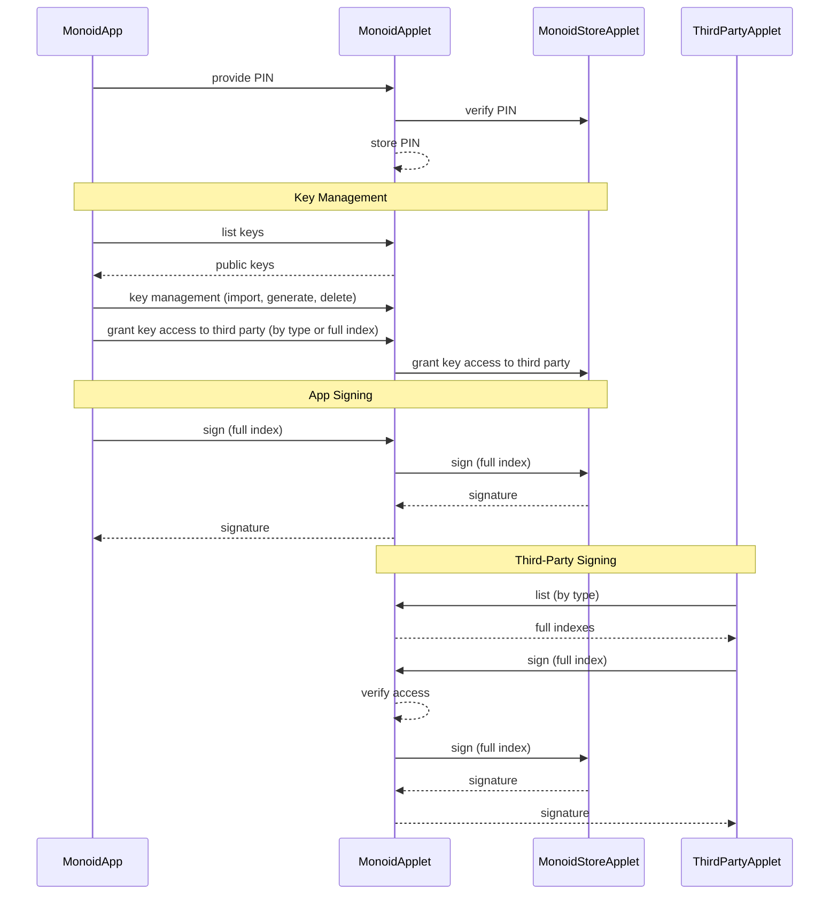

# Monoid Architecture

```mermaid
sequenceDiagram
    participant MonoidApp
    participant MonoidApplet
    participant MonoidStoreApplet
    participant ThirdPartyApplet

    MonoidApp ->> MonoidApplet: provide PIN
    MonoidApplet ->> MonoidStoreApplet: verify PIN
    MonoidApplet -->> MonoidApplet: store PIN

    note over MonoidApp, MonoidStoreApplet: Key Management

    MonoidApp ->> MonoidApplet: list keys
    MonoidApplet -->> MonoidApp: public keys
    MonoidApp ->> MonoidApplet: key management (import, generate, delete)
    MonoidApp ->> MonoidApplet: grant key access to third party (by type or full index)
    MonoidApplet ->> MonoidStoreApplet: grant key access to third party

    note over MonoidApp, MonoidStoreApplet: App Signing

    MonoidApp ->> MonoidApplet: sign (full index)
    MonoidApplet ->> MonoidStoreApplet: sign (full index)
    MonoidStoreApplet -->> MonoidApplet: signature
    MonoidApplet -->> MonoidApp: signature

    note over MonoidApplet, ThirdPartyApplet: Third-Party Signing

    ThirdPartyApplet ->> MonoidApplet: list (by type)
    MonoidApplet -->> ThirdPartyApplet: full indexes
    ThirdPartyApplet ->> MonoidApplet: sign (full index)
    MonoidApplet -->> MonoidApplet: verify access
    MonoidApplet ->> MonoidStoreApplet: sign (full index)
    MonoidStoreApplet -->> MonoidApplet: signature
    MonoidApplet -->> ThirdPartyApplet: signature
```
