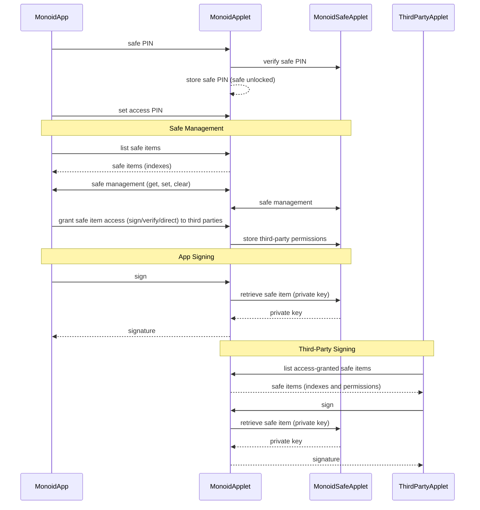

# Monoid Architecture

```mermaid
sequenceDiagram
    participant MonoidApp
    participant MonoidApplet
    participant MonoidSafeApplet
    participant ThirdPartyApplet

    MonoidApp ->> MonoidApplet: safe PIN
    MonoidApplet ->> MonoidSafeApplet: verify safe PIN
    MonoidApplet -->> MonoidApplet: store safe PIN (safe unlocked)

    MonoidApp ->> MonoidApplet: set access PIN

    note over MonoidApp, MonoidSafeApplet: Safe Management

    MonoidApp ->> MonoidApplet: list safe items
    MonoidApplet -->> MonoidApp: safe items (indexes)
    MonoidApp <<->> MonoidApplet: safe management (get, set, clear)
    MonoidApplet <<->> MonoidSafeApplet: safe management
    MonoidApp ->> MonoidApplet: grant safe item access (sign/verify/direct) to third parties
    MonoidApplet ->> MonoidSafeApplet: store third-party permissions

    note over MonoidApp, MonoidSafeApplet: App Signing

    MonoidApp ->> MonoidApplet: sign
    MonoidApplet ->> MonoidSafeApplet: retrieve safe item (private key)
    MonoidSafeApplet -->> MonoidApplet: private key
    MonoidApplet -->> MonoidApp: signature

    note over MonoidApplet, ThirdPartyApplet: Third-Party Signing

    ThirdPartyApplet ->> MonoidApplet: list access-granted safe items
    MonoidApplet -->> ThirdPartyApplet: safe items (indexes and permissions)
    ThirdPartyApplet ->> MonoidApplet: sign
    MonoidApplet ->> MonoidSafeApplet: retrieve safe item (private key)
    MonoidSafeApplet -->> MonoidApplet: private key
    MonoidApplet -->> ThirdPartyApplet: signature
```
