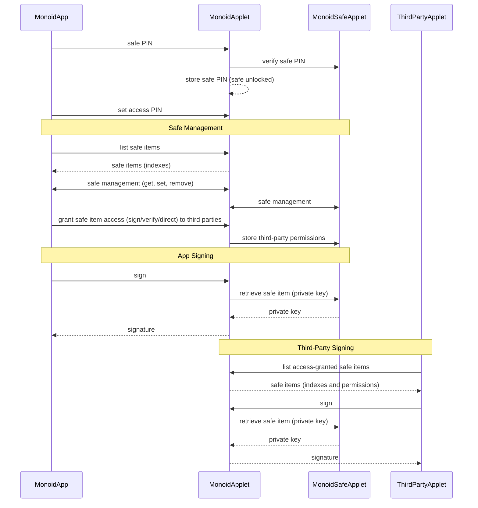

# Monoid Architecture

## Some thoughts

### Third-party applet to _Monoid Applet_ authentication nodes

> Under the assumption that third-party applets hold the credentials to access the safe via _Monoid Applet_, so upgrade or reinstallation of _Monoid Applet_ will not reset applets' access to the safe.

~~Consider situation that a malicious user don't have the PIN but want to access the safe, the user could potentially replace the _Monoid Applet_ to intercept interactions from third-party applets.~~

This is not an issue, because all access to the safe is possible only when _Monoid Applet_ has the safe PIN. Replacing _Monoid Applet_ will vanish the safe PIN stored.
